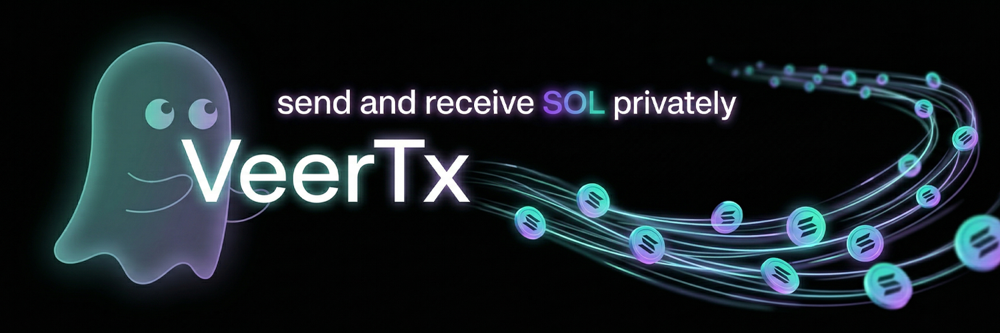

# What is VeerTx?

<figure><figcaption></figcaption></figure>

VeerTx is a non-custodial privacy payment router built exclusively for the Solana network. It allows users to send and receive SOL and USDC without exposing their wallet balances or transaction history to the public.

### The Problem with Public Blockchains&#x20;

Solana is a public ledger. By default, every time you send or receive a payment, the other person can see exactly how much money is in your wallet and every transaction you have ever made. You would never show a cashier your entire bank statement just to buy a coffee, but that is exactly how standard crypto transactions work today.

### The VeerTx Solution&#x20;

VeerTx solves this by permanently severing the on-chain link between the sender and the receiver. When you use a VeerTx payment link, the funds do not travel directly from Wallet A to Wallet B. Instead, the payment is routed through our automated privacy pool system. This ensures that the sender only sees a temporary deposit address, and the receiver gets their funds distributed from the main pool.

### Core Features

* True Financial Privacy: Senders and receivers never interact directly on the blockchain.
* Non-Custodial Routing: Your funds are automatically processed through smart routing. We do not hold your SOL or USDC.
* Seamless Payment Links: Generate a single link to receive payments from anyone at any time (Limits: 0.7 to 20 SOL | 50 to 2000 USDC).
* Automated by Helius: We use enterprise-grade Helius webhooks to monitor deposits and sweep funds securely behind the scenes.
